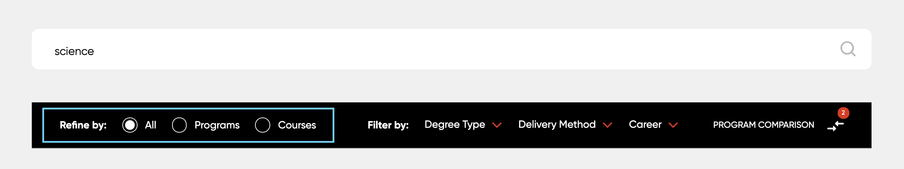
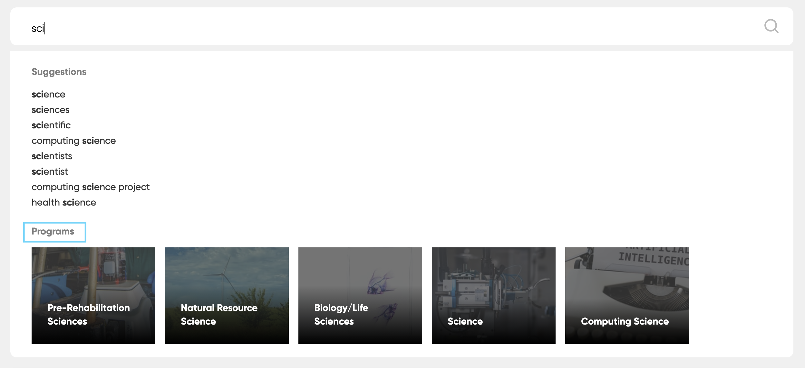

# Localising the Program Finder

Many higher education institutions structure their study options using the following:

* Programs - Primary type - This is the overarching qualification which awarded through completion one or more courses.
* Courses - Secondary type - These are the units of study that needs to be completed and contribute credit points towards earning qualifications (i.e. primary type).  

*Note: Study options can be much more diverse but we will ignore them for the time being as the current Program Finder only focuses these two.*

Sadly, the names used for the primary and secondary types will vary between region to region.

e.g.
* In the US, the primary type is "Programs" and the secondary is "Courses"
* In the UK, it is "Courses" and "Modules".
* In AU, it is "Courses and "Units".

The following is a guide on how to configure the Program Finder to better suit the language of the institution.

At a higher level, the process will involve:

* Configuring the finder type
* Changing the name of the facet labels
* Configuring the search previews
* Configure the concierge channel

## Steps

### Configuring the finder type

In the profile configurations, set the primary and secondary finder types
using the following configurations:

```java
stencils.I18n.finder_type_primary=<name_of_primary_type>
stencils.I18n.finder_type_secondary=<name_of_secondary_type>
```

e.g. In the UK, programs are known as `courses` and courses are known as `modules`. The following will need

```java
stencils.I18n.finder_type_primary=course
stencils.I18n.finder_type_secondary=module
```

Note: Please use the singular and not the plural form.

### Changing the name of the facet labels

Tab facets are used to allow the user to filter by either by programs and courses.



These labels can be changed by following the steps below:

* On the meta collection, navigate to `Customise Faceted Navigation` and select the `Tabs` facet. 
* Change the `label` for each facet category to best suit the client's requirement.
* Take note of these labels as these will need to be used subsequent steps.

 


### Configuring the search previews

The Program Finder is powered by extra searches which rely
on the tabs for navigation. As we changed the `Tabs` facet in the previous
step, we need update the extra search configurations accordingly.

```java
stencils.search_preview.programs.category_label=<name_of_primary_type_used_in_facet>
stencils.search_preview.courses.category_label=<name_of_secondary_type_used_in_facet>
stencils.tabs.extra_searches.<name_of_primary_type_used_in_facet>=
stencils.tabs.extra_searches.<name_of_secondary_type_used_in_facet>=
```

e.g. Given when changed the following:

```plaintext
Programs ->  Courses
Courses ->  Modules
```

The new configuration will be:

```java
stencils.search_preview.programs.category_label=Courses
stencils.search_preview.courses.category_label=Modules
stencils.tabs.extra_searches.Courses=
stencils.tabs.extra_searches.Modules=
```

### Configure the concierge channel

In additional to organic query completion, the Program Finder provides supports
for multiple channels of contextual auto-complete suggestions.

e.g.


The label for the `Program` can be changed using the following in profile
configurations:

```java
stencils.auto-completion.datasets.courses.name=<new_label>
```

## Nice to do

### Change the service title

It is best practice to set the service
title to something which is user friendly as this is what is used in
the marketing dashboard.

```java
service.title=<client_name> Program Finder
```
