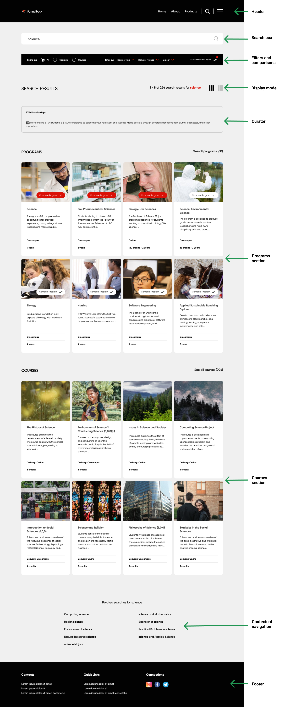
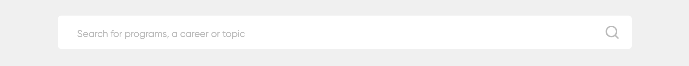
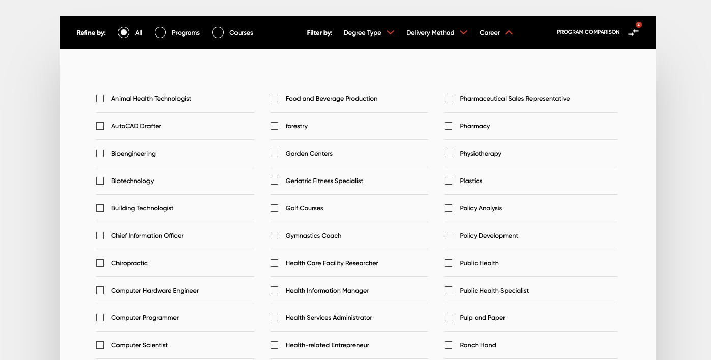
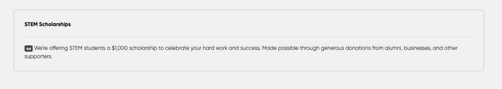
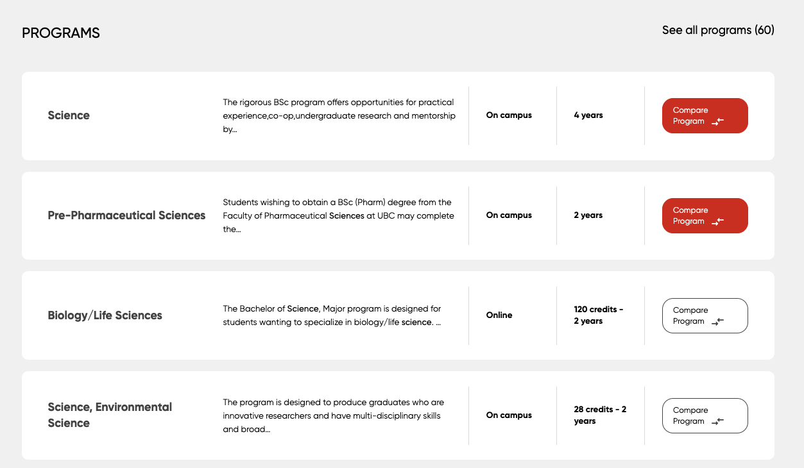
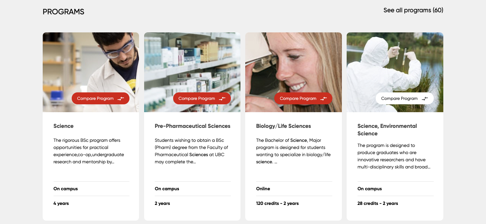
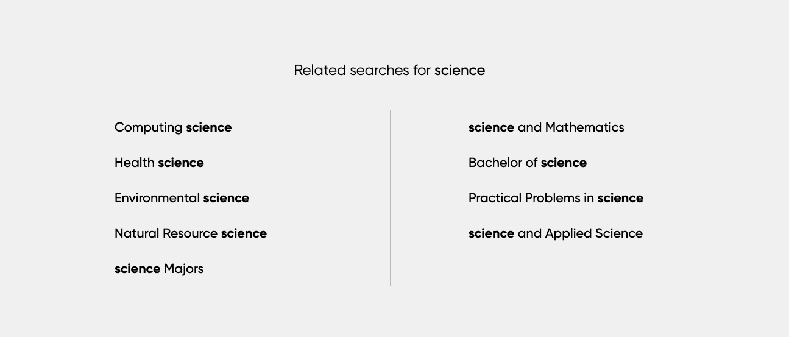
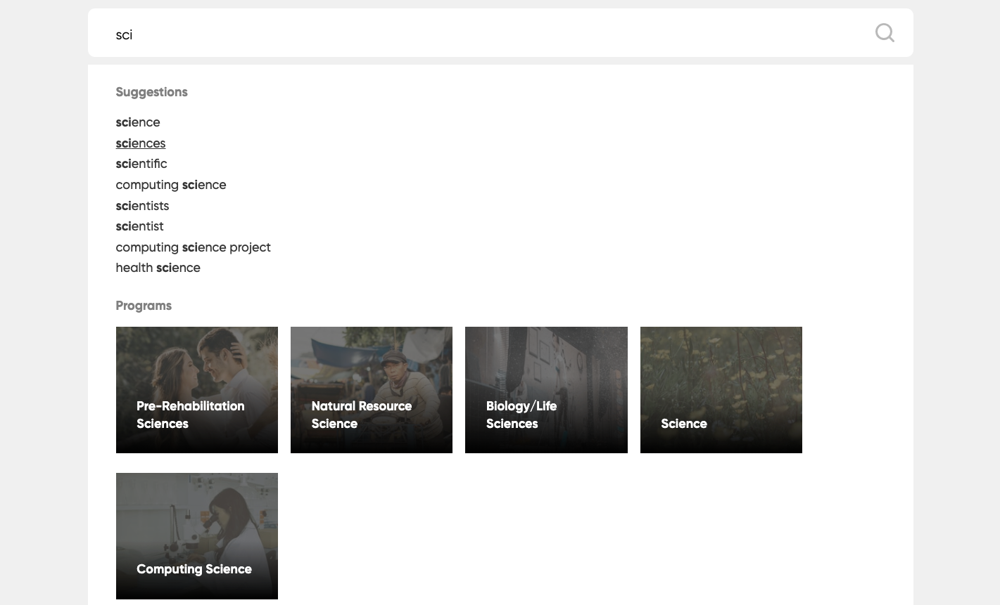
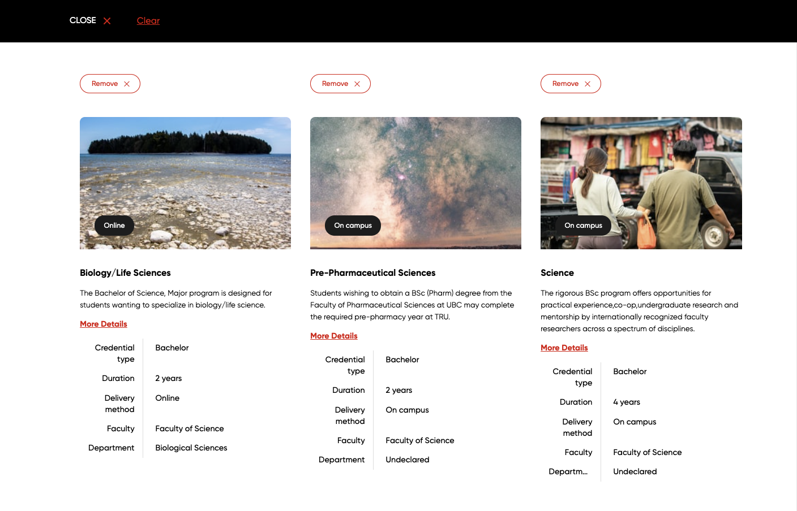
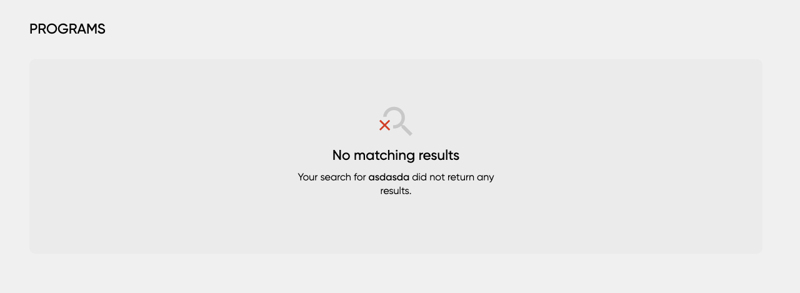

include::shared-content::partial$shared-attributes-default.adoc[]
= Program Finder configuration reference
v2.2
:page-search-title: Program Finder configuration reference
:page-search-keywords: Program Finder package solution|Program Finder Stencil
:page-description: This guide describes the configuration options that apply to the Program Finder.
:page-content-type: Documentation
:page-article-type: Documentation
:page-article-nav-section: Reference guides
:page-article-featuresgroup: Search frontends
:page-article-features-frontend: Stencils

toc::[]

== Introduction

=== Purpose

This aim of this document is to provide a quick overview of the things which are generally included in a standard deployment of the Program Finder. 

At a high level, changes to content such as labels and data are relatively 
straight forward whereas changes to functionality and presentation will require
custom work. 

== General considerations

=== Fonts and colors

The initial prototype implementation of the Program Finder will re-use the colours and fonts of the main website in a best effort fashion.

This means that minimal changes in these styles will be made (e.g. changing the color of specific elements, font size or weight, etc.) to ensure that the Program Finder is presentable and functional. 

If more dramatic changes are required, a complete custom style sheet along with a up to date style guide must be provided.

=== Icons

Various Funnelback components or features use icons. Alternative icons can be requested from either:

* http://fontawesome.io/[Font Awesome] library of icons or
* Provided as image files.

== Search results page overview

Below is a typical example of a Program Finder implementation.

Each component and the list of configuration options can be found below.

== Header and footer

The header and footer are static content blocks that are always displayed at the top & bottom of the page.

The header usually contains a logo, a navigation menu and the search box.

The footer usually contains additional links, contact details and copyright notices.

For a seamless search experience it's recommended that the header and footer on the search results page are identical to the ones on the main website.

=== What you can change
* Insert static HTML which can be directly into the
search implementation.
* Source the header and footer directly from the website or CMS.

== Search box

The search box allows the user to enter their query and the main way
they will interact with the search.

=== What you can change
* The placeholder text.
* The icon used for the submit button.

== Filters and comparison

Search filters meet expectations of students to filter results that match their desired location, mode of delivery, or level of study. 

=== What you can change
* The labels used for each. i.e. All -> All results.
* Add or remove filters and determine where to source the data from (limited to structured data crawled by Funnelback).
* Change the order of facets.
* Change the behaviour from allowing multiple selections to only being able to select one category at a time.

=== What you cant change
* Change the number of columns to be displayed.
* Add data which is not found in Funnelback.

== Display mode

Relevant programs/courses results displayed as a list and/or set of cards.
The display mode toggle provides the ability for the user to switch
between these two modes to better suit their desired search experience.

=== What you can change
* Disable the control altogether so that the user only has access to the default. 
* Select either list or card as default. 
* Choose different icons.

=== What you cant change
* Add additional options beyond list and card view

== Curator

Guide the student journey by promoting and
modifying results so students find quick answers
with the most relevant programs and courses.

Drive traffic to the most relevant content and
streamline UX by creating your own rules, triggers,
and appearance of search results.

=== What you can change
* Add and remove curator rules via the Funnelback Marketing Dashboard.
* Change "Ad" to something else. 

=== What you cant change
* The order of the elements.

== Programs and Courses sections

The programs and courses section are the primary focus on the search implementation
and arguably the most important. The Program Finder provides the ability to show results
in two formats;

__List view__

__Card view__

The following rules apply for both list and card views.

=== What you can change
* Only show one section by removing either Programs or Courses.
* Change the title, summary and metadata fields shown in each result.
* Change the summary so that it is either dynamic based on the user's query or static
base on the program or course data.
* Remove the image or provide a placeholder if one is not available.
* The number of metadata fields to show. Recommended is between 1-3.
* Include labels for certain metadata fields.

=== What you cant change
* Display data which is not found within Funnelback.
* Changing the order of the overall elements. i.e. Title -> summary -> metadata fields

== Quick view

Quick view allows the user view more information about a particular document without them having to leave the search results page. This aims to minimise the amount of hopping back and forth between systems.

=== What you can change
* 

=== What you cant change
* 

== Contextual Navigation

Contextual navigation suggests a list of related searches by analysing the result summaries in the set of results returned for a search.

Contextual navigation surfaces these sub-topics by presenting them to users as suggestions for refining their query. 

=== What you can change
* The number of suggestions to show.

=== What you cant change
* Add additional columns.

== Concierge

Using Funnelback’s auto-suggest feature, visitors can
navigate straight to program information from the
search bar. This is the most effective way to shorten
the visitor’s journey and improve user experience.
Search-as-you-type reduces the chance of spelling
mistakes, helps to prevent users from arriving
at dead ends, and allows the institution to direct
attention to the highest-value program pages. 

=== What you can change
* Only short organic auto complete suggestions by removing the programs channel
* Change the title, metadata fields or image using for Program auto complete suggestions.
* Change the number of auto complete suggestions shown for each category.

=== What you cant change
* Add additional channels in addition to Programs.

== Comparison

[.lead]

Compare let students evaluate a side-by-side comparison of majors or programs that they are considering.

=== What you can change
* Content being used for the tags, title and summary.
* Length of summary.
* Number of metadata fields to display
* Labels for each metadata
* Add placeholder images or remove images altogether.

=== What you cant change
* Change the order of saved results

== No Results

A simply message is displayed when the search does not return any result.

=== What you can change
* Change the no results message
* Change the icon

== Final Thoughts

Hopefully, this documentation provides an indication on what can and can't be changed in a standard implementation of Program Finder. But of course, there are 
bound to be edge cases and things which are not covered. If there is any doubts
or concerns, please speak with the Squiz team and they will be able to help determine if it is possible.   