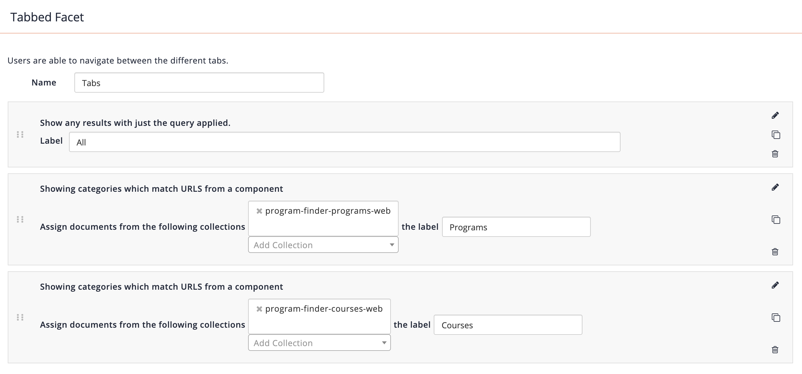

# Program Finder Vertical Product

This is a quick reference guide to implementing the Program Finder Vertical Product.

At a high level, you will need to:

* **Setup the program and courses collections** - Create the collections and map the relevant metadata.
* **Setup the meta collection** - Using this git repo as the basis, setup a new meta collection.
* **Configure the extra searches** - Create and configure the programs and courses extra searches.
* **Setup the faceted navigation** - Adjust the `Tabs` and other relevant facets.
* **Customise the result presentation** - Display the relevant images and metadata for the results (both card and list views).
* **Customise the quick view presentation** - Display the relevant images and metadata for the quick view.
* **Configure concierge** - Customise the concierge to display the relevant metadata.
* **Configure cart** - Customise the cart to display the relevant metadata.
* **Configure the header and footer** - Add the client's header and footer to assist with a seamless transition from client's website to search.

## Setup the programs and courses collections

The first step is to create two collections which will gather the programs and courses. The collection type can vary depending on how the data is made available (please see the funnelback documentation website for more details). When it comes to naming the collection, it is recommended to use the following format:

`<client>-program-finder-<collection_type>`

The important aspect of this step is to get the documents indexed and mapped to the appropriate metadata classes.

The metadata classes are the key drivers as they are used in result presentation, concierge, cart and faceted navigation. Where possible, please use the default metadata classes (names starting with `stencils` or `program`/`course`) names which have been setup in the sample collections.

### Programs

Programs are the qualifications or accreditation earned which is awarded for completing a set number of courses.

For an example of a program collection please see `program-finder-programs-web`.

### Courses

Courses are subjects, units or modules that student undertake as part of a Program. They usually involve lectures, tutorials, workshops, labs etc.

For an example of a course please see `program-finder-courses-web`.

## Setup the meta collection

The meta collection contains the majority of the application and presentation logic required for the Program Finder Vertical Product. It is recommended to name the collection use the following format:

`<client>-program-finder-meta`

e.g. `funnelback-program-finder-meta`

## Configure the extra searches

The Program Finder uses extra searches to display programs and courses in separate areas on the search engine result page.

To configure the extra searches, change the target collection in the following: extra search config:

`extra_search.programs.cfg`

```java
collection=<name_of_meta_collection>
query_processor_options=-num_ranks=8 -clive=<name_of_program_collection> -log=off -curator=off -spelling=off -show_qsyntax_tree=off -explain=false
```

`extra_search.courses.cfg`

```java
collection=<name_of_meta_collection>
query_processor_options=-num_ranks=8 -clive=<name_of_course_collection> -log=off -curator=off -spelling=off -show_qsyntax_tree=off -explain=false
```

## Setup the faceted navigation

The Program Finder relies on a facet called `Tabs` which determines when programs or courses should be displayed. An example of the faceted navigation configuration can be found below:



Change the value in the collections field for the Programs and Courses facets categories so that they reference the relevant collections.

## Customise the result presentation

It is fairly common that clients would like to customise the way programs and courses are presented so that it best meets their requirement. This can include but not limited to:

* Adding, changing or removing metadata.
* Changing the length of title or summary.
* Updating the html structure prevent or correct css collisions.

This can be done by modifying `<#macro GenericView>` in [programs.ftl](_default_preview/programs.ftl) and [courses.ftl](_default_preview/courses.ftl) templates.

## Customise the quick view presentation

Quick view allows the user view more information about a particular document without them having to leave the search results page. This aims to minimise the amount of hopping back and forth between systems.

It is possible to customise how this is displayed by modifying `<#macro QuickView>` in [programs.ftl](_default_preview/programs.ftl) and [courses.ftl](_default_preview/courses.ftl) templates.

## Configure the concierge

In addition to organic query completion, Concierge is setup to bring back relevant programs in a dedicated channel. This can be customised by
modifying  `<#macro AutoCompleteTemplate>` in the [programs.ftl](_default_preview/programs.ftl) template.


## Configure the cart

Similarly to the results presentation, it is possible to customise how programs the cart are displayed. This can be done by modifying  `<#macro CartTemplate>` in the [programs.ftl](_default_preview/programs.ftl) template.

## Configure the header and footer

To help mimic the look and feel of the client's website, it is possible to configure the header and footer to use the clients markup and script.
`<link to header and footers ftl>`

## Review the search

Congratulations! Once you completed the above steps, you should have something similar to the following:


